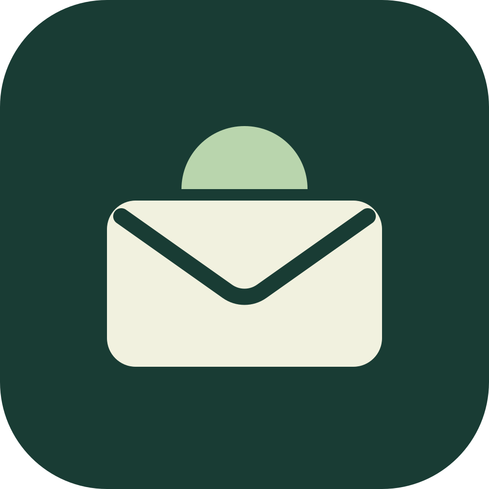

# Morrow Mail

**An open-source email client for macOS and Windows, with calendars, an agent CLI and your choice of AI.**

[](https://github.com/Coke1120/Morrow-Mail/actions/workflows/check.yml)
[](LICENSE)
[](https://github.com/Coke1120/Morrow-Mail/releases)

[Download](https://github.com/Coke1120/Morrow-Mail/releases) · [User guide](docs/USER_GUIDE.md) · [Agent CLI](docs/CLI.md) · [Feature coverage](FEATURE_COVERAGE.md)

Morrow is a local, single-user app: **SwiftUI on macOS**, **WinUI 3 on Windows**, and a shared **Rust service**. Desktop packages include their runtime; no Node, Electron or Rust installation is needed to use them.

## Download

Get a beta package and its SHA-256 checksum from [GitHub Releases](https://github.com/Coke1120/Morrow-Mail/releases).

| Platform | Package | Install |
| --- | --- | --- |
| macOS 13.5+, Apple silicon | `Morrow-Mail-<version>-macos-arm64.zip` | Unzip and move **Morrow Mail.app** to Applications. |
| Windows 10/11, x64 | `Morrow-Mail-<version>-windows-x64.zip` | Extract the **entire folder**, keep its files together, and run **Morrow Mail.exe**. |

**Experimental beta:** macOS builds are ad-hoc signed without Apple notarization; Windows builds are unsigned and may show SmartScreen warnings. Full live-account, clean-machine and accessibility acceptance remains incomplete. See [verification](VERIFICATION.md) before relying on Morrow for critical mail.

Upgrading from beta.4 or earlier requires a manual download because those versions use the retired update URL. Back up your workspace and quit the old app before replacing it. See [backup and recovery](docs/USER_GUIDE.md#backup-and-recovery).

## Get started

1. Open **Settings → Mail accounts** and connect Gmail, Outlook / Microsoft 365, or IMAP / SMTP. Use **Sync** for the selected mailbox or **Today → Sync All** for every connected account.
2. Optionally connect Google Calendar or Outlook Calendar under **Settings → Calendar**.
3. For AI assistance, configure an OpenAI-compatible endpoint or Ollama under **Advanced setup → AI connection**, then choose permitted folders and fields in **AI & privacy**. AI is optional.

Browser sign-in uses the desktop registration included in the build; custom registrations remain available. Source builds without Google configuration need a custom Google client. See [mailbox setup](docs/USER_GUIDE.md#connect-a-mailbox) and the [OAuth guide（繁體中文）](docs/OAUTH_SETUP.zh-TW.md).

## What it does

- **Mail:** multiple accounts, combined inboxes, To/Cc/Bcc, reply/reply-all/forward, provider folders and Gmail labels, local Pending/Later markers, and reviewed scheduled sends.
- **Search:** local full-text search, Chinese traditional/simplified matching, filters and saved searches; optional semantic indexing with a reviewed scope and budget.
- **Calendars:** Google and Outlook month views, explicit event creation and provider reminders. Invitations and editing/deleting existing events are not implemented.
- **AI assistance:** summaries, reply suggestions, translation, inbox questions and reviewed writing-style learning. Optional automation requires consent; AI never sends mail by itself. Studio simulations are labeled separately.
- **Agent access:** JSON commands for reading mail and preparing, reviewing and explicitly sending owned drafts through the same Rust service.

Detailed behavior and limits are in [feature coverage](FEATURE_COVERAGE.md) and the [user guide](docs/USER_GUIDE.md).

## Current source and beta downloads

`main` includes the following changes from [PR #22](https://github.com/Coke1120/Morrow-Mail/pull/22), **not yet included in beta.48 downloads**:

- Attachment add/remove/download/save, reviewed sending and scheduling: **100 files / 50 MiB total per message**. Provider send limits and MIME encoding overhead still apply; attachment bytes stay out of AI context.
- New history imports fetch the **latest seven days first**, then older mail. Gmail/IMAP read/star write-back and checkpointed cached-message reconciliation complement Outlook delta sync. Sync remains bounded, not a complete server mirror.
- CLI `sync`, `status`, `--dry-run`, MIME `fetch` and attachment commands.
- **Today** updates one summary card per mailbox/local date while keeping job history.
- **Install & Restart** accepts ongoing activity, drains accepted work and resumes safe checkpointed work. Unsaved edits stay protected; uncertain deliveries and unfinished paid requests never replay automatically.

See the [changelog](CHANGELOG.md), [release notes](docs/releases/) and [verification](VERIFICATION.md) for version-specific changes and test evidence.

## Agent CLI

The CLI ships inside `morrow-service` from **v0.6.0-beta.3**. It returns JSON and works with the app open or closed. Set up your accounts in the app first.

For macOS, define a temporary shell helper:

```sh
morrow() { '/Applications/Morrow Mail.app/Contents/Resources/morrow-service' cli "$@"; }
morrow accounts
morrow list --account all --folder inbox --limit 20
morrow read --account person@example.com --id 'provider-message-id'
```

For Windows PowerShell, adjust the extracted app path:

```powershell
function morrow { & 'C:\Apps\Morrow Mail\resources\app\runtime\morrow-service.exe' cli @args }
morrow accounts
```

The extended commands below require a build from current source; beta.48 does not include them:

```sh
morrow sync --account all --dry-run
morrow sync --account person@example.com
morrow status --account person@example.com
```

`list`, `search` and `read` use cached mail without marking it read or triggering AI. `sync` explicitly fetches a bounded round of recent mail; `fetch` downloads MIME/attachments for an already cached message. Sending uses **draft → review → send --confirm** with the owning account and reviewed payload. Never automatically retry an uncertain send.

See the [CLI guide](docs/CLI.md) for draft/send examples, attachments, workspaces, JSON output and exit codes. External agents with workspace access can read mail independently of the app's AI checkboxes; grant access only to agents you trust.

## Data and safety

Mail is stored locally in SQLite in `~/Library/Application Support/Morrow Mail` on macOS or `%APPDATA%\Morrow Mail` on Windows. **Message content is plaintext.** Credentials are encrypted with a key in the same directory; protect and back up both the database and key.

Mail/calendar operations contact their providers. Enabled AI requests send permitted content to your selected model endpoint; local storage does not make remote AI processing offline. The reader blocks scripts and external images by default, with explicit image consent and destination review for links.

Scheduled mail and background jobs require Morrow to remain running. See [data and configuration](docs/USER_GUIDE.md#data-and-configuration), [backup and recovery](docs/USER_GUIDE.md#backup-and-recovery), and [known limits](FEATURE_COVERAGE.md).

## Build from source

Use **Rust 1.98+** with rustfmt/clippy, plus Apple's Swift command-line tools on macOS or the [pinned Windows prerequisites](windows/README.md). Node/npm is not used.

```sh
# macOS
/bin/sh scripts/build-macos-native.sh
```

```powershell
# Windows
./scripts/build-windows-native.ps1 -Zip
```

For checks, source layout and release rules, see [AGENTS.md](AGENTS.md). Platform details are in the [macOS guide](docs/USER_GUIDE.md#native-macos-app) and [Windows README](windows/README.md). Use an isolated absolute `MORROW_DATA_DIR` for fixtures; never test against a real mailbox workspace.

## Documentation

| Document | Contents |
| --- | --- |
| [User guide](docs/USER_GUIDE.md) | Account setup, mail, calendars, AI, search, updates, backup and recovery |
| [Agent CLI](docs/CLI.md) | Commands, reviewed sending, attachments and automation contract |
| [Feature coverage](FEATURE_COVERAGE.md) | Implemented features, simulations and limits |
| [Verification](VERIFICATION.md) | Test evidence and outstanding production acceptance |
| [OAuth setup（繁體中文）](docs/OAUTH_SETUP.zh-TW.md) | Google/Microsoft registrations and permissions |
| [Changelog](CHANGELOG.md) · [Release notes](docs/releases/) | Version history |

## Support and license

[MIT](LICENSE) © 2026 Morrow Mail contributors. Independent and inspired by Genspark GenMail; not affiliated with Genspark.

Optional support: [GitHub Sponsors](https://github.com/sponsors/Coke1120) · [Buy Me a Coffee](https://buymeacoffee.com/Coke1120). Donations do not unlock features.
